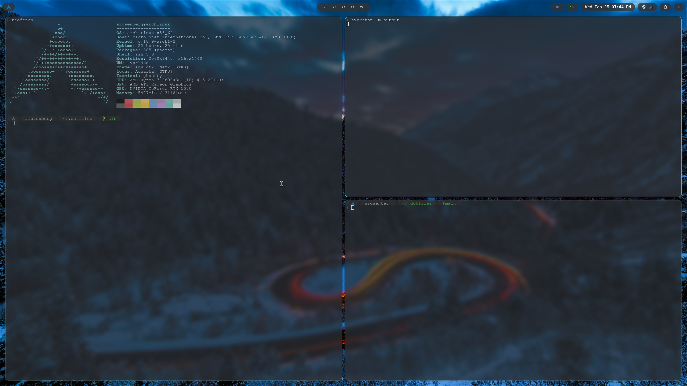
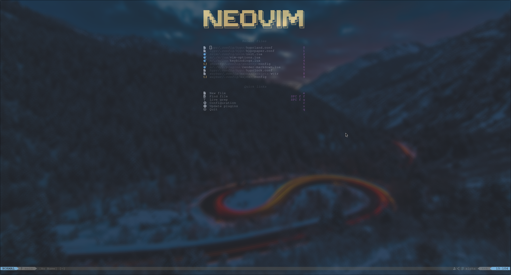
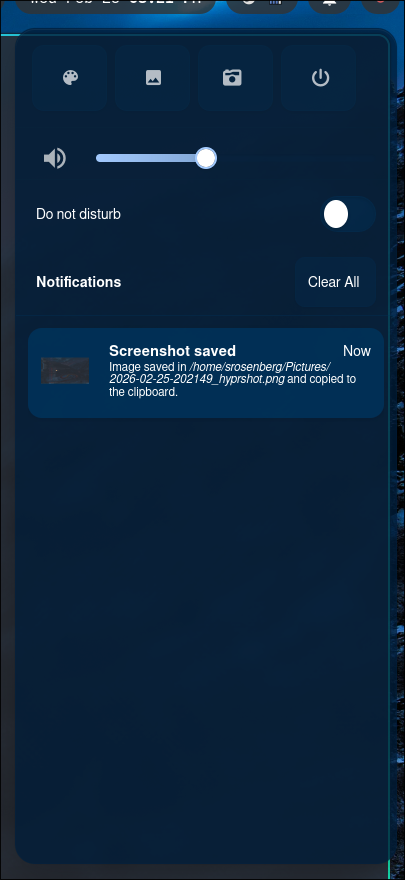
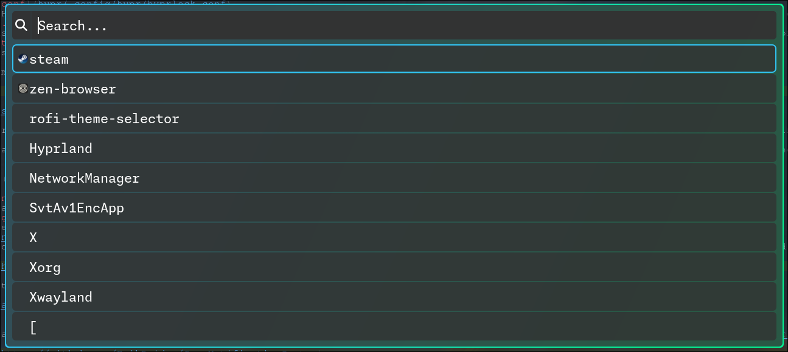

# My Dotfiles

This repository contains all of my dotfiles used to setup my Hyprland Arch configuration, Neovim setup, and Ghostty + Zsh terminal

Please feel free to grab any bits and bobs and apply to your own configuration!

> [!NOTE]
> This configuration is definitely subjet to change as I discover new customizations and update existing ones. so just because it's here today, doesn't mean it will be tomorrow. :) 

# TOC

- [Hyprland](#hyprland)
- [Neovim](#neovim)
- [Waybar](#waybar)
- [Swaync](#swaync)
- [Rofi](#rofi)
- [Ghostty + Zsh + OhMyPosh](#ghostty-+-zsh-+-ohmyposh)

## Hyprland

- [hyprland.conf](hypr/.config/hypr/hyprland.conf)
    - In here you can find my startup programs, keybindings, and other OOTB hyprland config
- [hypridle.conf](hypr/.config/hypr/hypridle.conf)
    - This includes the settings for Hyprlands idle management daemon (general lock, 5 min timeout, 5.5 min screen dim, 30 min suspension)
- [hyprlock.conf](hypr/.config/hypr/hyprlock.conf)
    - This is Hyprlands native screen lock. It's set up to blur the screen, show the current date and time and then an input for your password obviously
- [hyprpaper.conf](hypr/.config/hypr/hyprpaper.conf)
    - Hyprlands native wallpaper application. This sets the current [background](backgrounds/.config/backgrounds.the-hills.jpg) to both my monitors
- [hyprsunset.conf](hypr/.config/hypr/hyprsunset.conf)
    - Hyprlands native blue light/night mode application

For more information on any of these configs check out the [Hyprland Wiki](https://wiki.hypr.land/) in Hypr Ecosystem section.

## Neovim

I decided to create my own config over using a distro like NvChad or LazyVim because I thought it would be more fun. Let's just say it was definitely a great learning experience.

Thankfully I was able to take a some good inspiration from the [kickstart.nvim](https://github.com/nvim-lua/kickstart.nvim/tree/master) project and would definitely recommend a visit there to get started.

- [init.lua](nvim/.config/nvim/init.lua)
    - Contains the inital setup to Lazy nvim plugin manager
- [vim-options.lua](nvim/.config/nvim/lua/vim-options.lua)
    - Sets relative numbers, tab size, and the extra blink when yanking something
- [keybindings.lua](nvim/.config/nvim/lua/keybindings.lua)
    - All my key bindings in one file and I still can't remember them all
- [plugins](nvim/.config/nvim/lua/plugins)
    - This folder contains all my plugins, too many to name them all but the few that are a must: lsp-config, telescope, neo-tree, lualine, and of course colorscheme

## [Waybar](https://github.com/Alexays/Waybar)

See how it looks in the Hyprland image above

- [config](waybar/.config/waybar/config) & [style.css](waybar/.config/waybar/style.css)
    - Contains the base layout and styling for my waybar
 
The directory also contains some helper files for a [power menu](waybar/.config/warbar/power_menu.xml) and [local weather retriever](waybar/.config/waybar/scripts/wttr) to display in the waybar.

## [Swaync](https://github.com/ErikReider/SwayNotificationCenter)

Contains a style I copied straight from the swaync repo's [config flex](https://github.com/ErikReider/SwayNotificationCenter/discussions/183). I'd say still a WIP to create my own to match the theme I have going on.

## [Rofi](https://github.com/davatorium/rofi)

Rofi is my app launcher of choice. Tried to match the native style of Hyprland but another work in progress to get it a little more polished.

## Ghostty + Zsh + OhMyPosh

Ghostty is my terminal of choice with native tabbing and splits. The [config](ghostty/.config/ghostty/config) just contains setup for the Monospice Nerd Font as well as the customary 90% background opacity so I can always see my background. I'm running zshell as well and my [.zshrc](zsh/.zshrc) contains some setup for history tracking and ohmyposh setup.

My ohmyposh [config](ohmyposh/.config/ohmyposh/config.json) is pretty minimal, with just OS logo, full path, and git branch. Don't sleep on the transient prompt though.

